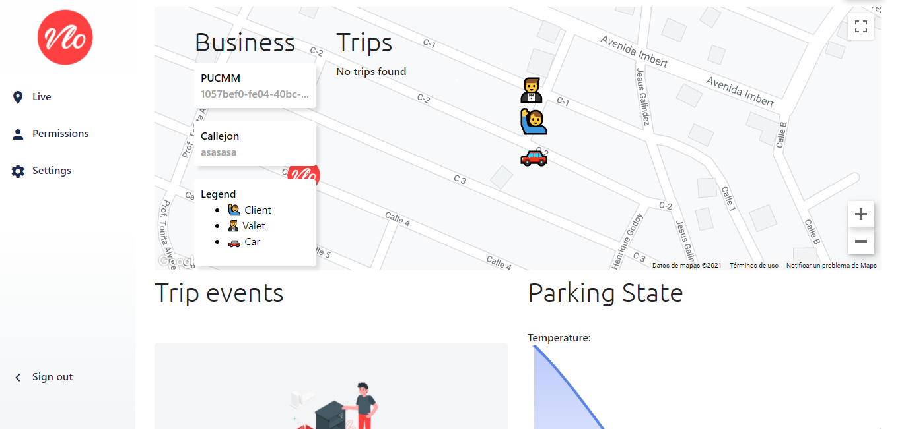

# Vlo Parking
A project for giving security and simplify the Valet Parking services with live tracking and parking conditions tracking. 
Client-side React Native application for Vloparking. The entire project was built with, Node.js, React, React Native, Websockets, and Lora-wan.



## Built With

- Lora WAN
- React.js
- React Native
- Expo
- Socket.io
- Express
- React Bootstrap

# General purpose of the project

To enhance security in valet parking business with the use of technology giving the security both to the manager of the business and the client itself.

# Features:

The full project includes features as:

- Real-time tracking of valets.
- Real-time tracking of the vehicle.
- Vehicle speed tracking.
- Detection of unauthorized vehicle movements.
- Parking lots of monitoring.
- Fire, temperature, and humidity monitoring.
- Lora-wan integration.
- Live data serving.

# Modules:

- [Admin panel](https://github.com/elberthcorniell/vlo-parking-server)
- [Valet app](https://github.com/elberthcorniell/vloparking-vallet)
- [Client app](https://github.com/elberthcorniell/vloparking)
- Lora-wan module (Contact me)

## Getting Started

To get all modules up and running, follow these simple example steps.

### Prerequisites

- Node.js
- Expo CLI

### Setup for server

1- Clone the repository
```
    git clone https://github.com/elberthcorniell/vlo-parking-server.git
```

2- Open the folder on the VS Code (or your preferred code editor). 
```
    cd vlo-parking-server
    code .
```

3- Install the required dependencies.
```
    npm install
```

4- Run server. 
```
    npm run dev
```
The server should be running at port 3001.


#### React.js Build

Run the next on your terminal in the repository folder:

- For development build:
```
    npm run webpack
```

- For production build:
```
    npm run production
```

### Set up React Native apps

1- Clone the repository
```
    git clone https://github.com/elberthcorniell/vloparking.git
```

2- Open the folder on VS Code (or your preferred code editor). 
```
    cd vloparking
    code .
```

3- Install the required dependencies.
```
    npm install
```

4- Run expo app. 
```
    expo start
```
The server should be running at port 19000. Scan the QR on the screen with the expo mobile app.


# Database ERD

Please contact me for the ERD cause at the moment of writing this document I didn't have it.

### Testing

Run the next on your terminal in the repository folder:

```
    npm test
```

## Author

👤 **Elbert Corniell**

- GitHub: [@elberthcorniell](https://github.com/elberthcorniell)
- Twitter: [@elberthcorniell](https://twitter.com/elberthcorniell)
- LinkedIn: [LinkedIn](https://www.linkedin.com/in/elbert-corniell-989183159/)


## 🤝 Contributing

Contributions, issues, and feature requests are welcome!

Feel free to check the [issues page](https://github.com/elberthcorniell/vloparking/issues).

## Show your support

Give an ⭐️ if you like this project!

## 📝 License

This project is [MIT](./LICENSE) licensed.
